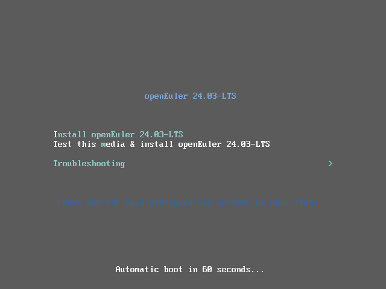
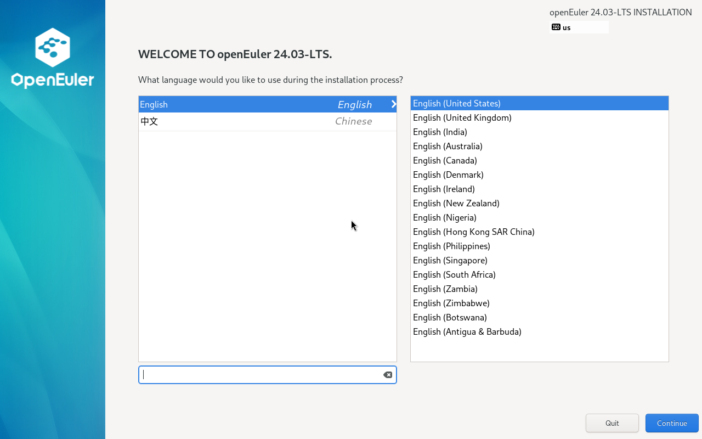
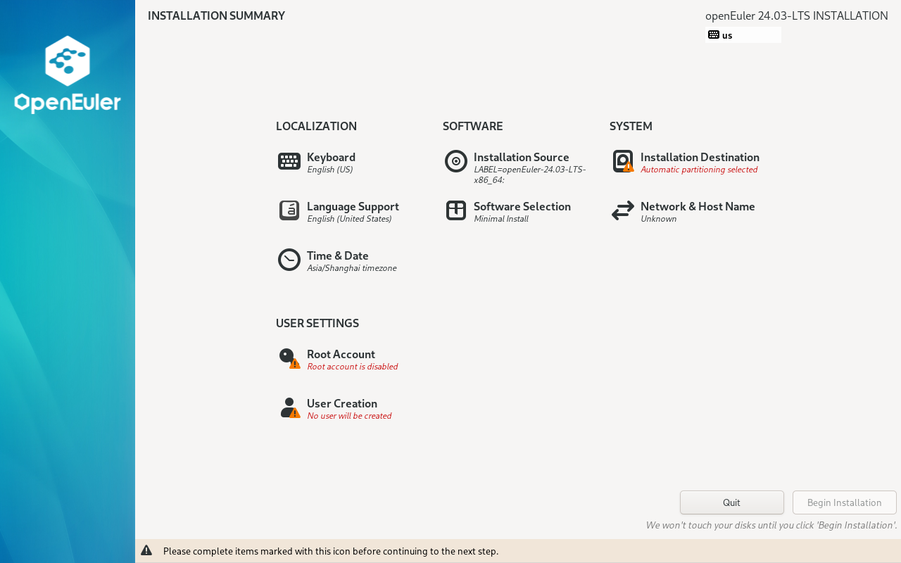
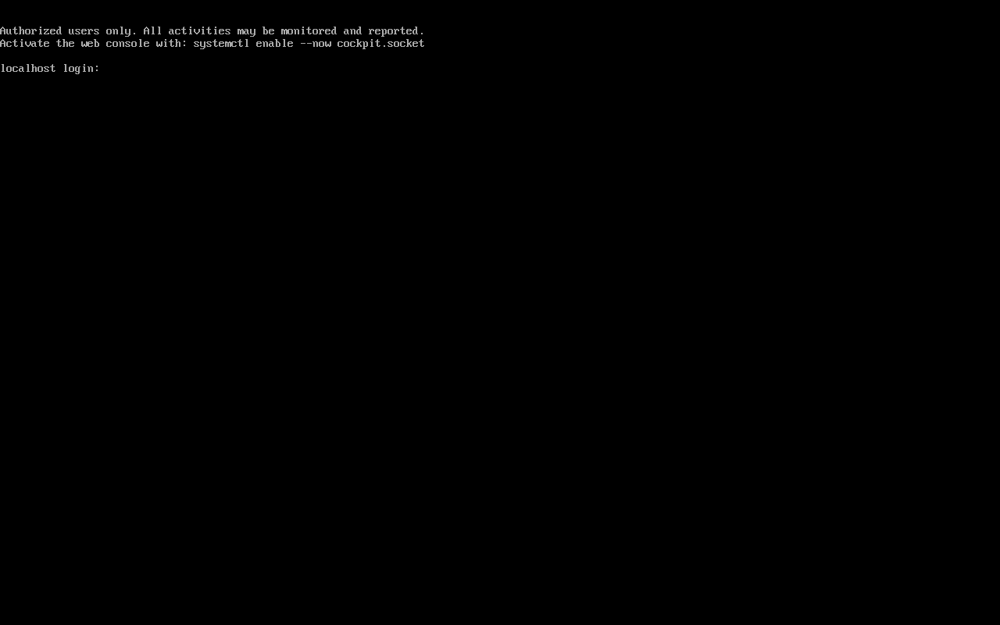
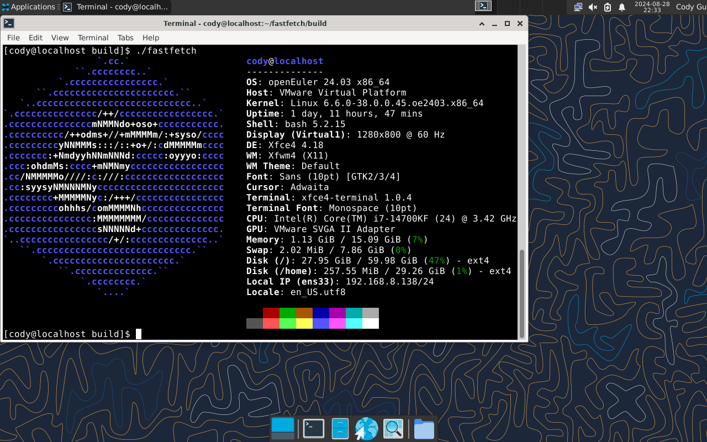

# 在 VMware 虚拟机中安装 openEuler 24.03 x86_64

主要测试环境:
 - VMware® Workstation 17 Pro 17.5.1 build-23298084
 - Windows 11 Pro, 64-bit (Build 22631.4037) 10.0.22631

## 下载镜像

首先在镜像站下载`openEuler`系统镜像，路径是`/openeuler/openEuler-24.03-LTS/ISO/x86_64/`

我实际是从 [tuna 镜像](https://mirror.tuna.tsinghua.edu.cn/openeuler/openEuler-24.03-LTS/ISO/x86_64/) 下载的，你也可以选择其他更快的镜像源，选择`openEuler-24.03-LTS-everything-x86_64-dvd.iso`下载全量系统镜像。

## 创建虚拟机&系统安装

打开 VMware ，点击`文件-新建虚拟机`进入新建虚拟机向导。选择`自定义(高级)(C)`，兼容选项默认，选择刚刚下载的`openEuler-24.03-LTS-everything-x86_64-dvd.iso`镜像文件，客户机操作系统选择`Linux(L)`，版本选择`其他 Linux 6.x 内核 64 位`，然后拟定一个虚拟机名称，并选择安装位置。处理器数量选择`1`，每个处理器的内核数量尽量选择多一点，不然后期编译的时候可能会很慢，电脑本身的内核数量，可以在任务管理器中查看。虚拟机的内存最好小于宿主机的内存-4G，一般16G就够了，可以适当大一点。网络类型的话，如果不清楚每个选项的意思可以直接选择默认。磁盘大小建议大于100G，默认不会立即占用所有容量，虚拟机用多少会占用多少，其他保持默认就行了。

随后点击`开启此虚拟机`就可以进入系统了。

进入系统后回车选择安装系统

选择你使用的键盘布局和语言

这个是openEuler的安装器主选单，可以选择你的安装位置，预装软件和用户名等设置。所有设置都选择完成后，可以点击右下角的`Begin Installation`开始安装。等待一段时间后，就可以点击`Reboot System`重启虚拟机了，会自动引导安装好的系统。

开机后系统界面如下图所示，输入你创建的用户名和密码进入系统

系统信息：

按照[这个教程](https://docs.openeuler.org/zh/docs/24.03_LTS/docs/desktop/Install_XFCE.html)安装xfce桌面环境，[fastfetch 编译步骤](https://github.com/fastfetch-cli/fastfetch/wiki/Building)

## 参考链接

https://docs.openeuler.org/zh/docs/24.03_LTS/docs/desktop/Install_XFCE.html

https://github.com/fastfetch-cli/fastfetch/wiki/Building