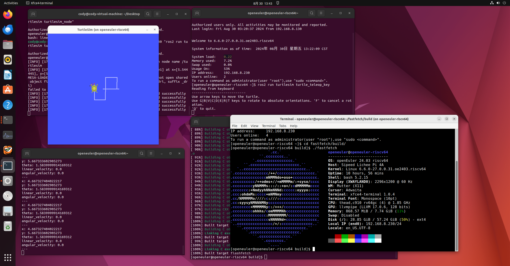

# 在 LicheePi 4A 上运行 openEuler 24.03

测试环境：
 - LicheePi 4A 8+8 内测版

## 下载安装 openEuler 系统并设置从 tf卡启动

首先下载openEuler系统镜像，[下载地址](https://repo.openeuler.org/openEuler-24.03-LTS/embedded_img/riscv64/lpi4a/)

需要下载`root`和`boot`分区镜像，以及`uboot镜像`。根据你的板卡内存大小选择合适的镜像，8G选择`u-boot-with-spl-lpi4a.bin`，16G选择`u-boot-with-spl-lpi4a-16g.bin`

烧写步骤可以参考 [这篇文章](https://wiki.sipeed.com/hardware/zh/lichee/th1520/lpi4a/4_burn_image.html) 和 [这篇文章](https://github.com/revyos/revyos/blob/main/Installation/licheepi4a.md)，这里就不赘述了，这边主要补充如何在内测版硬件上使用tf卡启动。

首先，把boot分区按照正常的步骤烧写到emmc中，然后将root分区烧写到tf卡中。

复制一份`/boot/extlinux/extlinux.conf` 文件，并命名为`extlinux_tf.conf`

```bash
cp /boot/extlinux/extlinux.conf /boot/extlinux/extlinux_tf.conf
```

修改里面的文件成下面的内容，主要是把原本的`root=/dev/mmcblk0p3`变成`root=/dev/mmcblk1`。mmcblk0是emmc,mmcblk1是tf卡

```text
menu title U-Boot menu for openEuler RISC-V TH1520
         timeout 50
         default openEuler-riscv

         label openEuler-riscv
                 menu label Linux openEuler-riscv
                 kernel /vmlinuz-6.6.0-27.0.0.31.oe2403.riscv64
                 fdtdir /dtb-6.6.0-27.0.0.31.oe2403.riscv64
                 append root=/dev/mmcblk1 console=ttyS0,115200 rootwait rw earlycon clk_ignore_unused loglevel=7 eth= rootrwoptions=rw,noatime rootrwreset=yes selinux=0
```

然后重启系统，使用串口在启动过程中中断自动启动，进入uboot命令行。需要注意的是板卡的rx引脚已经有分压电阻，无需再进行电平转换，可以直接接入3.3v ttl，tx是1.8v ttl，所以tx可能需要一个电平转换器。

添加下面两个环境变量，并保存

```sh
setenv mmccheck 'if mmc dev 1; then setenv boot_conf_file /extlinux/extlinux_tf.conf; else setenv boot_conf_file /extlinux/extlinux.conf;fi'

setenv bootcmd 'run bootcmd_load; bootslave;run mmccheck; sysboot mmc ${mmcdev}:${mmcbootpart} any $boot_conf_addr_r $boot_conf_file;'

saveenv
```

然后再次重启，就能看到已经成功从tf卡启动了，如果你要从emmc启动原本的系统，可以把tf卡拔掉，再次启动。

可以通过下面的命令对分区进行扩容。

```bash
sudo resize2fs /dev/mmcblk1
```

由于oERV 24.03主线用的是 6.6 内核，[暂时没有HDMI驱动](https://github.com/revyos/revyos/issues/74)，因此需要使用ssh进行远程连接

首先按照[这个教程](https://docs.openeuler.org/zh/docs/24.03_LTS/docs/desktop/Install_XFCE.html)安装xfce桌面环境，再按照[这个教程](/src/2-oe-ros2-test/2-1-install-ros2-on-oe2403.md)安装ROS2环境

在`/etc/ssh/sshd_config`中修改`X11Forwarding`项为`yes`

然后重启sshd

```bash
sudo systemctl restart sshd
```

就可以在你的电脑上使用下面的命令通过`x11forward`启动`Licheepi 4A`上的小海龟界面了，同理，其他需要显示界面的程序都可以这样显示

```bash
ssh -X openeuler@192.168.xx.xx "ros2 run turtlesim turtlesim_node"
``` 



## 参考文章

https://openeuler-ros-docs.readthedocs.io/en/latest/installation/lpi4a-rv-oe.html

https://bbs.eeworld.com.cn/thread-1258199-1-1.html

https://docs.openeuler.org/en/docs/22.03_LTS_SP1/docs/desktop/installing-Xfce.html

https://github.com/revyos/th1520-linux-kernel/commits/th1520-lts-wip/

https://wiki.sipeed.com/hardware/zh/lichee/th1520/lpi4a/4_burn_image.html

https://github.com/revyos/revyos/blob/main/Installation/licheepi4a.md