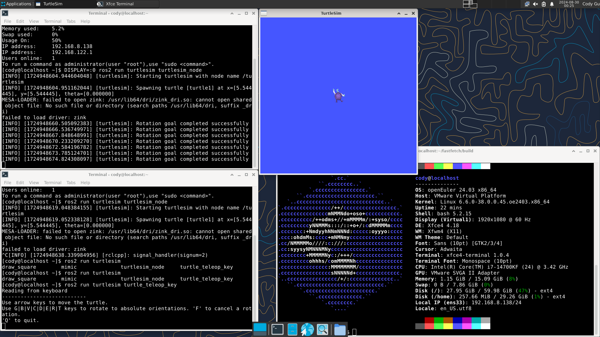

# 在 openEuler 24.03 上安装 ROS2 Humble

测试环境:
 - openEuler 24.03

## 添加 ROS2 软件源

**注意**：

目前 openEuler 24.03 以上版本需要手动添加软件源

- x86架构软件源配置：

```bash
bash -c 'cat << EOF > /etc/yum.repos.d/ROS.repo
[openEulerROS-humble]
name=openEulerROS-humble
baseurl= https://eulermaker.compass-ci.openeuler.openatom.cn/api/ems1/repositories/ROS-SIG-Multi-Version_ros-humble_openEuler-24.03-LTS-TEST4/openEuler%3A24.03-LTS/x86_64/
enabled=1
gpgcheck=0
EOF'
```

- ARM架构软件源配置：

```bash
bash -c 'cat << EOF > /etc/yum.repos.d/ROS.repo
[openEulerROS-humble]
name=openEulerROS-humble
baseurl=https://eulermaker.compass-ci.openeuler.openatom.cn/api/ems1/repositories/ROS-SIG-Multi-Version_ros-humble_openEuler-24.03-LTS-TEST4/openEuler%3A24.03-LTS/aarch64/
enabled=1
gpgcheck=0
EOF'
```

- RISC-V架构软件源配置：

```bash
bash -c 'cat << EOF > /etc/yum.repos.d/ROS.repo
[openEulerROS-humble]
name=openEulerROS-humble
baseurl=https://build-repo.tarsier-infra.com/openEuler:/ROS/24.03/
enabled=1
gpgcheck=0
EOF'
```

然后进行一个软件源的更新

```bash
dnf update
```

## 安装ROS Humble

以下命令安装 ROS2 Humble 的所有软件包

```bash
dnf install "ros-humble-*" --skip-broken --exclude=ros-humble-generate-parameter-library-example
```

也可输入以下命令安装单独软件包：

```bash
dnf install ros-humble-<package-name>
```

例如输入以下命令安装 ROS2 Humble 基础包和 turtlesim 包

```bash
yum install ros-humble-ros-base ros-humble-turtlesim
```

要使用 ros 的软件和命令，需要 `source` 一下 `/opt/ros/humble/setup.bash`

```bash
source /opt/ros/humble/setup.bash
```

或者输入以下命令将上述语句写入`~/.bashrc`文件，每次开启终端都会自动 `source`

```bash
echo " source /opt/ros/humble/setup.bash" >> ~/.bashrc 
```

随后重启终端或手动输入`source ~/.bashrc`来激活ROS环境变量的设置

## 测试小乌龟

安装ROS后，打开终端输入以下命令启动小乌龟仿真测试：

```bash
ros2 run turtlesim turtlesim_node
```

如果你是ssh远程连接的，可以在命令前加上`DISPLAY=:0`，这样图形界面会显示到屏幕上

```bash
DISPLAY=:0 ros2 run turtlesim turtlesim_node
```

新建终端，输入以下命令启动键盘控制节点，在英文输入法下，可以根据终端提示按下键盘的按键控制小乌龟运动：

```
ros2 run turtlesim turtle_teleop_key
```

如果小乌龟仿真测试通过，说明 openEuler ROS2 Humble 已成功安装～



## 参考链接

https://openeuler-ros-docs.readthedocs.io/en/latest/installation/install-ros-humble.html